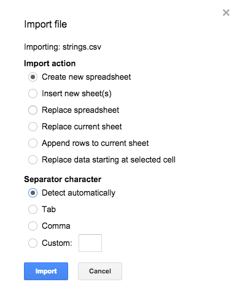
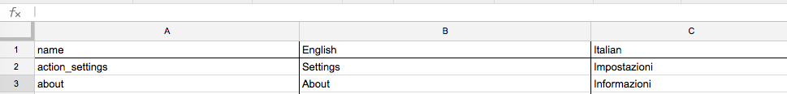
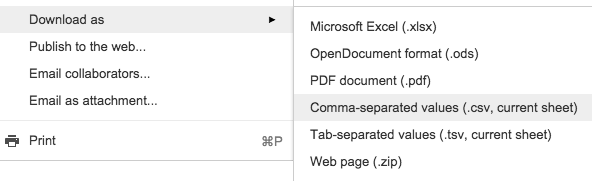

# Android strings convertor

Android strings convertor is a tool to convert strings resources to csv and back, written in Ruby.
It can be used to translating Android strings resources in Google Docs. 
Original inspiration for writing this tool was by this [gist]

## Workflow
	
	- Create a CSV file from Android XML
	- Import CSV to Google Docs
	- Translate strings to other language
	- Download CSV from Google Docs
	- Create a translated XML file from CSV
	- ???
	- Profit!

## Google Docs

### Importing:
  

### Translating:
  

### Downloading CSV
  

## Gems
1, Using [nokogiri]
<pre>gem install nokogiri</pre>

## Usage
<pre> ruby conv.rb xml strings.xml language >> strings.csv</pre>
<pre> ruby conv.rb csv strings.csv language >> strings.xml</pre>

## Version
0.1b - Initial commit

[gist]:https://gist.github.com/takuya-i/3117040
[nokogiri]:http://www.nokogiri.org/